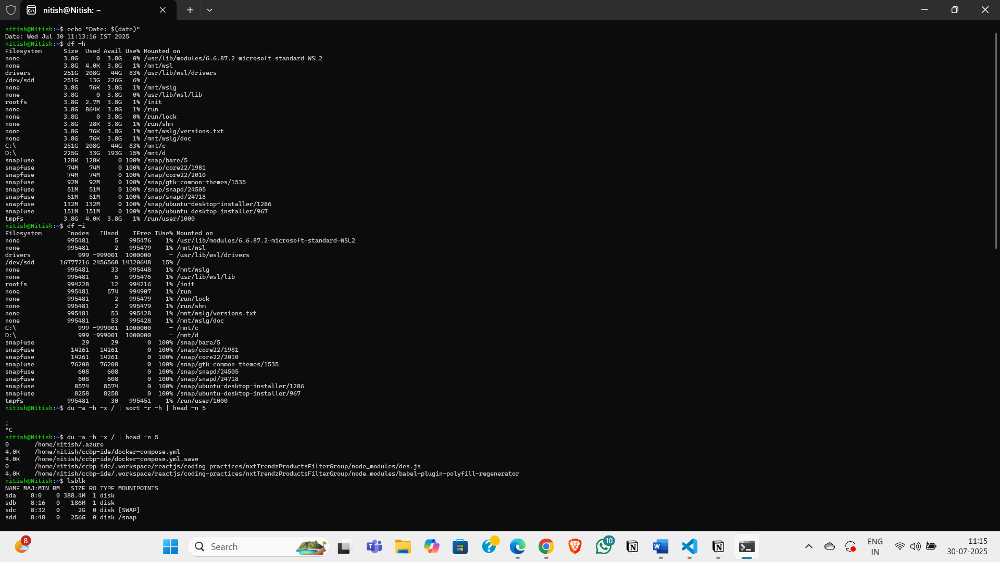

# 🧠 Disk Usage & Health Monitor

A cross-platform CLI toolkit to **check disk usage, partition layout, and SMART health status** — built as part of my Google IT Support Certification project practice.

---

## 💻 Platforms Supported

- ✅ **Linux** (Bash Script)
- ✅ **Windows** (PowerShell Script)

---

## 🔧 Features

- 📊 Mounted filesystem usage
- 📂 Top space-consuming directories
- 🧱 Partition layout overview
- 🧬 SMART disk health check
- 📁 Drive and volume info (Windows)

---

## 📦 How to Run

### 🐧 On Linux:

```bash
chmod +x disk_check_linux.sh
./disk_check_linux.sh
```

> 🔐 Note: SMART health check requires `smartmontools` and `sudo` privileges.

### 🪟 On Windows (PowerShell):

```powershell
.\disk_check_windows.ps1
```

> 💡 Run PowerShell as Administrator to access SMART health data.

---

## 🔍 Linux Script Breakdown

### `disk_check_linux.sh`

```bash
#!/bin/bash

echo "======= Disk Health & Usage Report (Linux) ======="
# ➤ Prints a heading for the report

echo "Date: $(date)"
# ➤ Displays the current date and time

echo

echo "[1] Mounted Filesystems:"
df -h
# ➤ Shows usage of all mounted filesystems with human-readable sizes

echo

echo "[2] Disk Inodes:"
df -i
# ➤ Displays inode usage, which helps identify inode exhaustion issues (common on servers)

echo

echo "[3] Top 5 Largest Directories in /:"
du -ahx / | sort -rh | head -n 5
# ➤ Lists all directories/files under /, sorts them by size (descending), and shows top 5
# ➤ Useful for spotting space hogs

echo

echo "[4] Partition Layout:"
lsblk
# ➤ Lists all block devices and their partitions (tree structure)

echo

echo "[5] Disk Health (SMART Data):"
sudo smartctl -H /dev/sda
# ➤ Shows SMART health status of the main disk (typically /dev/sda)
# ➤ Requires `smartmontools` and `sudo` permissions
```

---

## 🪟 Windows Script Breakdown

### `disk_check_windows.ps1`

````powershell
Write-Host "======= Disk Health & Usage Report (Windows) ======="
# ➤ Prints a heading for the report

Write-Host "Date: $(Get-Date)"
# ➤ Displays current date and time

Write-Host ""

Write-Host "[1] Drive Usage Summary:"
Get-PSDrive -PSProvider FileSystem
# ➤ Lists all logical drives (C:, D:, etc.) with used/available space

Write-Host ""

Write-Host "[2] Volume Info:"
Get-Volume
# ➤ Shows detailed info about each volume (filesystem, health, label, size)

Write-Host ""

Write-Host "[3] Top 5 Largest Folders in C:\\ (May take time):"
Get-ChildItem C:\\ -Recurse -ErrorAction SilentlyContinue |
    Where-Object { $_.PSIsContainer } |
    Sort-Object {
        (Get-ChildItem $_.FullName -Recurse -ErrorAction SilentlyContinue |
         Measure-Object -Property Length -Sum).Sum
    } -Descending |
    Select-Object FullName -First 5
## 📂 Top 10 Largest Folders in C:\ (Optimized)

```powershell
Write-Host "[3] Top 10 Largest Top-Level Folders in C:\\"

Get-ChildItem C:\ -Directory -Force -ErrorAction SilentlyContinue |
ForEach-Object {
    $folderPath = $_.FullName
    $folderSize = (Get-ChildItem $folderPath -Recurse -ErrorAction SilentlyContinue | Measure-Object -Property Length -Sum).Sum
    [PSCustomObject]@{
        Folder = $folderPath
        SizeGB = [math]::Round($folderSize / 1GB, 2)
    }
} | Sort-Object SizeGB -Descending | Select-Object -First 10
````

---

### 🔍 What This Script Does (Line-by-Line)

| Line                                   | What It Does                                                     |
| -------------------------------------- | ---------------------------------------------------------------- |
| `Write-Host ...`                       | Prints a heading so users know what this section is              |
| `Get-ChildItem C:\ -Directory`         | Gets a list of all **top-level folders** in the `C:\` drive      |
| `-Force -ErrorAction SilentlyContinue` | Includes hidden folders and avoids error spam                    |
| `ForEach-Object { ... }`               | Loops through each folder and performs actions                   |
| `$folderPath = $_.FullName`            | Saves the full folder path                                       |
| `Get-ChildItem $folderPath -Recurse`   | Recursively lists all files/subfolders in that folder            |
| `Measure-Object -Property Length -Sum` | Sums the size of all files in bytes                              |
| `[math]::Round(... / 1GB, 2)`          | Converts the total size to gigabytes and rounds it to 2 decimals |
| `Sort-Object SizeGB -Descending`       | Sorts folders by size, biggest first                             |
| `Select-Object -First 10`              | Returns only the **top 10 largest folders**                      |

---

### 🚀 Why This Version Rocks

- ⚡ Much **faster** than scanning the entire drive recursively like the previous version
- 💥 Avoids CPU overload and system lag
- ✅ Works on most systems without needing admin rights
- 📊 Gives a practical overview of **where your disk space is going**

---

### 🧠 Example Output

```text
Folder                                SizeGB
------                                ------
C:\Users                              35.42
C:\ProgramData                        15.76
C:\Windows                            11.89
C:\Program Files                      10.55
C:\Temp                               4.33
...
```

---

### 💡 Pro Tip

If you want it even **faster**, avoid recursion entirely and just estimate folder sizes using rough heuristics — but this version gives you a solid balance between speed and accuracy.

Write-Host ""

Write-Host "[4] Disk Health (Basic Status):"
Try {
Get-WmiObject -Class Win32_DiskDrive | Select Model, Status
} Catch {
Write-Host "Could not retrieve disk health via WMI."
}

Write-Host ""
Write-Host "[4.1] Disk Health (Advanced - if smartmontools installed):"
Write-Host "Run: smartctl -H /dev/sda (Replace with correct disk name)"

## 🧬 Disk Health Check (Windows)

```powershell
Write-Host "[4] Disk Health (Basic Status):"
```

🖨️ **Prints a section header** for the basic disk health check using built-in WMI tools.

---

```powershell
Try {
    Get-WmiObject -Class Win32_DiskDrive | Select Model, Status
}
```

✅ **Tries to fetch the disk drive model and basic health status**

- `Get-WmiObject -Class Win32_DiskDrive`  
  → Talks to Windows Management Instrumentation (WMI) to list all physical disk drives.

- `Select Model, Status`  
  → Narrows the output to just the **Model** (e.g., “Samsung SSD 870”) and the **Status** (e.g., “OK”, “Pred Fail”).

💡 Why this matters:

- `"OK"` → The drive thinks it's healthy.
- `"Pred Fail"` → The drive is likely on its way out. Time to backup your data ASAP.

---

```powershell
Catch {
    Write-Host "Could not retrieve disk health via WMI."
}
```

🛑 **Handles any errors gracefully** — such as:

- Missing permissions
- WMI not available on the system
- Invalid device drivers

If something goes wrong, it prints a clean message instead of crashing.

---

```powershell
Write-Host ""
Write-Host "[4.1] Disk Health (Advanced - if smartmontools installed):"
Write-Host "Run: smartctl -H /dev/sda (Replace with correct disk name)"
```

💡 **Gives the user an advanced SMART health check option** using `smartctl` (from `smartmontools`).

- This does **not** run the command — it just prints a helpful reminder for advanced users.
- `smartctl` provides full SMART diagnostics like temperature, bad sectors, SSD wear level, etc.

🧠 **Example SMART Output:**

```bash
smartctl -H /dev/sda
=== START OF READ SMART DATA SECTION ===
SMART overall-health self-assessment test result: PASSED
```

---

### 🔧 TL;DR – What This Code Block Does

| Line                            | What It Does                               | Why It’s There                                 |
| ------------------------------- | ------------------------------------------ | ---------------------------------------------- |
| `Try { Get-WmiObject... }`      | Queries Windows for basic drive status     | Works on most systems                          |
| `Catch { ... }`                 | Catches any WMI errors                     | Makes the script error-proof and user-friendly |
| `Write-Host "Run: smartctl..."` | Suggests an advanced tool for SMART health | For users needing full diagnostic insights     |

````
----
---

## 🚀 Why This Project Matters

| 🧰 Skill            | 🛠️ Tool Used         | 🌍 Real-World Benefit               |
|--------------------|----------------------|-------------------------------------|
| Disk usage checks  | `df`, `Get-PSDrive`  | Prevent app crashes or OS failures  |
| Space hog detection| `du`, PowerShell     | Reclaim space, boost performance    |
| Partition analysis | `lsblk`, `Get-Volume`| Troubleshoot boot/mount issues      |
| Disk failure checks| `smartctl`, WMI      | Predict and avoid hardware failures |

---

## 🧠 Key Takeaways

* Gain **real-world system diagnostics** experience
* Show off **cross-platform CLI automation**
* Be **proactive**, not reactive, in IT support
* Build confidence in **hardware + OS-level tools**

---

## ✅ Requirements

### Linux:

* `bash`, `df`, `du`, `lsblk`, `smartctl` (from `smartmontools`)

```bash
sudo apt install smartmontools
````

### Windows:

- PowerShell 5.1+
- Admin privileges for SMART access

---

## 🙋‍♂️ Author

Built by **Nitish**  
As part of the _Google IT Support Professional Certificate_

---

## Sample Outputs

 .png>) .png>) .png>) .png>) .png>)

## 📜 License

MIT — Free to use, fork, and improve.
